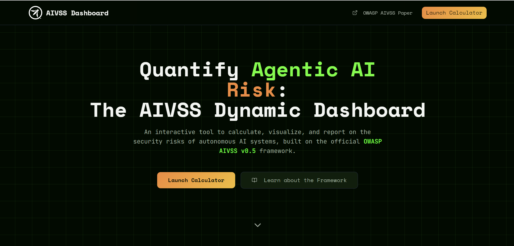

# AIVSS Dynamic Risk Assessment Dashboard


An interactive, professional-grade web application for calculating, visualizing, and reporting on AI agent security risks using the official **OWASP AIVSS v0.5 framework**.

**[➡️ Live Demo Here](https://aivss.parthsohaney.online/)**

---



## 📖 About This Project

The [OWASP AIVSS v0.5 report](https://aivss.owasp.org/assets/publications/AIVSS%20Scoring%20System%20For%20OWASP%20Agentic%20AI%20Core%20Security%20Risks%20v0.5.pdf) provides a groundbreaking framework for quantifying the unique security risks posed by autonomous AI systems. While the paper and its original calculator are excellent for understanding the core logic, a gap existed for an all-in-one, professional tool that could handle the entire assessment workflow from start to finish.

This project was built to bridge that gap.

The AIVSS Dynamic Risk Assessment Dashboard is more than a calculator—it's a complete workbench for security analysts, AI developers, and technical leaders. It transforms the theoretical framework from the PDF into a practical, interactive tool designed to make assessing and communicating agentic AI risk intuitive, efficient, and authoritative.

## ✨ Key Features

This dashboard goes far beyond a simple calculator by integrating a suite of professional features:

- **📊 Full CVSS v4.0 Calculator:** A complete, NIST-compliant CVSS v4.0 calculator is built directly into the dashboard. There is no need for external tools; perform the entire vulnerability assessment from start to finish in one place.

- **📈 Dynamic Risk Visualization:** Don't just see a number, see the _shape_ of the risk. The dashboard generates a real-time **AARS Radar Chart** and a **Score Contribution Bar Chart** to help you instantly understand the source and nature of the agent's risk profile.

- **🤔 "What-If" Scenario & Profile Management:** Save your complete assessments as named profiles (e.g., "Baseline Risk," "Mitigated - Tool Use Limited"). This transforms the tool into a strategic modeling dashboard, allowing you to measure the impact of security controls and make data-driven decisions.

- **🚀 Side-by-Side Comparison View:** Select any two of your saved profiles to render their scores and visualizations side-by-side. Instantly see the percentage reduction in risk from your proposed mitigations, making it easy to justify security investments.

- **📄 One-Click Professional PDF Reporting:** Generate a comprehensive, multi-page PDF report of your current assessment with a single click. The report includes an executive summary, scores, the full vector string, and all visualizations, solving the critical problem of documenting and sharing your findings.

## 🧠 Scoring Methodology

This tool is a faithful and compliant implementation of the **primary AIVSS-Agentic formula** detailed on **Page 54** of the official v0.5 report.

The final score is calculated using a transparent, 50/50 average between traditional and agentic risk:

- **CVSS Base Score:** Calculated automatically using the integrated CVSS v4.0 calculator, powered by the official `pandatix/js-cvss` library to ensure perfect compliance.
- **AARS (Agentic AI Risk Score):** Calculated as a direct sum of the 10 official AARS factors, each rated as None (0.0), Partial (0.5), or Full (1.0).
- **Threat Multiplier:** An adjustable modifier based on the CVSS v4.0 "Exploit Maturity" supplemental metric.

## 🚀 How to Use the Dashboard

This tool is designed to be an intuitive part of your security workflow.

1.  **Define the Vulnerability:** In the first column, use the **CVSS v4.0 Base Metrics** toggles to describe the traditional vulnerability. The CVSS Base score will update in real-time.
2.  **Define the Agent:** Use the **AARS Factors Assessment** toggles to rate each of the 10 agentic capabilities. The AARS score will update instantly.
3.  **Analyze the Results:** The center and right columns will display the final AIVSS score and all visualizations, giving you a complete picture of the risk.
4.  **Model & Compare:** In the center column, use the **Scenario Profiles** card to save your assessment. Create a second profile where you model a security control (e.g., changing an AARS factor from "Full" to "Partial"). Use the "Compare" buttons to see both profiles side-by-side at the bottom of the page.
5.  **Export Your Findings:** Once your analysis is complete, click the **"Generate Report"** button in the header to download a professional PDF of your current assessment.

## 🛠️ Tech Stack

- **Framework:** React (Vite)
- **Language:** TypeScript
- **Styling:** Tailwind CSS
- **UI Components:** shadcn/ui
- **Charting:** Recharts
- **PDF Generation:** jsPDF & html2canvas
- **CVSS Calculation:** `pandatix/js-cvss`
- **Deployment:** Vercel

## 🔧 Running Locally

To run this project on your local machine:

1.  **Clone the repository:**
    ```bash
    git clone https://github.com/Pa04rth/agentrisk-insight.git
    ```
2.  **Install dependencies:**
    ```bash
    npm install
    ```
3.  **Run the development server:**
    ```bash
    npm run dev
    ```
    The application will be available at `http://localhost:8080`.

## 📬 Contact

This project was built with a passion for cybersecurity and a belief in the power of open-source tools. If you have any questions, feedback, or would like to connect, please don't hesitate to reach out.

- **Parth Sohaney**
- **Email:** [parthsohaney04@gmail.com](mailto:parthsohaney04@gmail.com)
- **LinkedIn:** [linkedin.com/in/parthsohaney](https://www.linkedin.com/in/parthsohaney/)

---
